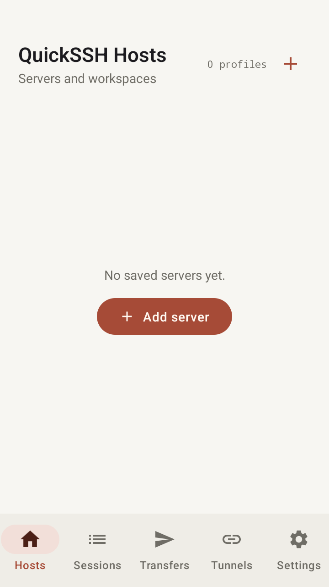
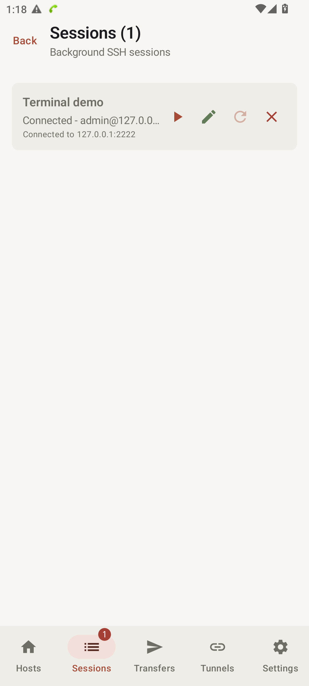
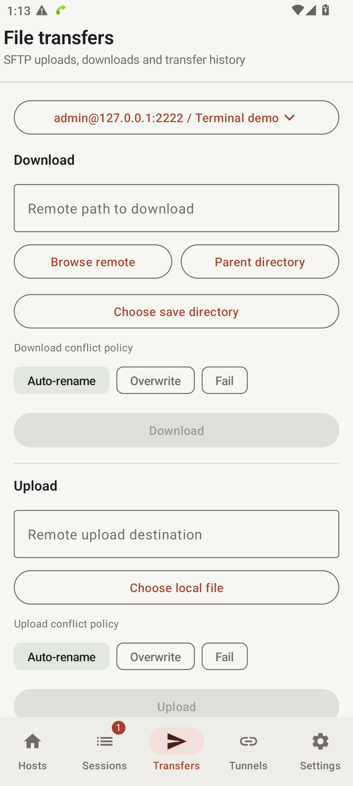
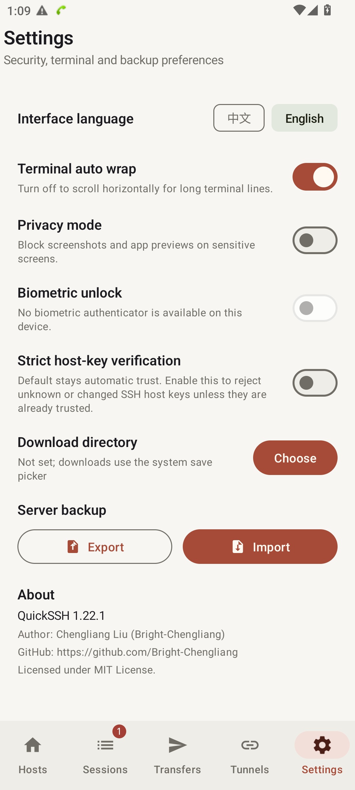
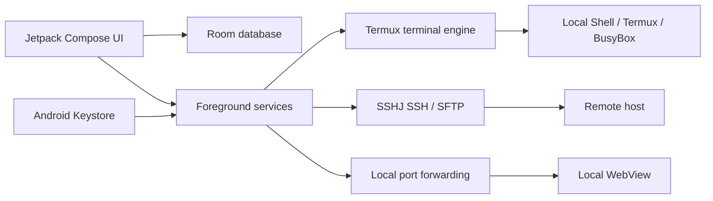

# QuickSSH

> A full-stack Android terminal workspace for local shells, persistent SSH sessions, Termux engine, SFTP transfers, and local port forwarding.

[中文版 README](README.md)

[](app/src/main/AndroidManifest.xml)
[](gradle/libs.versions.toml)
[](LICENSE)

QuickSSH is a native Android terminal workspace and SSH client built around real development workflows: local shell environments, persistent SSH sessions, multi-workspace profiles, Termux terminal engine, SFTP file operations, and access to private services through SSH tunnels. It uses Jetpack Compose for the UI, Termux kernel and SSHJ for local and remote sessions, Room for local persistence, and Android Keystore for credential protection.

## Why this project

Mobile terminal tools often force a choice between a standalone local terminal (like Termux) that lacks modern multi-workspace ergonomics, or a basic SSH client that cannot run offline, drops connections in the background, and struggles with touch scrolling in full-screen TUI tools (like OpenCode or Codex). QuickSSH unifies local shells and remote SSH into a single dual-mode workspace with persistent background execution, recoverable file transfers, port forwarding, and responsive touch gestures.

## Design Highlights

### Workspace-aware server profiles

<ins><em>Keep separate directories, commands, and terminal settings for multiple projects on the same server.</em></ins>

**Motivation:** One server can host multiple projects or environments. A single flat connection record forces users to repeatedly re-enter working directories, terminal preferences, and post-connect commands, increasing the chance of using the wrong environment.

**Implementation:** Server profiles are grouped by `host / port / username / authType`, while each workspace stores its own working directory, post-connect command, terminal settings, and shortcuts. Room stores servers, workspaces, tunnel presets, and transfer history with migrations for upgrades.

<p align="center"></p>

### Long-running SSH sessions

<ins><em>Long-running remote commands keep running when the phone is backgrounded or locked.</em></ins>

**Motivation:** Backgrounding or locking a phone should not terminate an important shell task. Binding the SSH connection directly to a screen makes that failure mode almost inevitable.

**Implementation:** Foreground services own SSH sessions and support reconnecting after network recovery. The terminal layer handles ANSI colors, cursor control, TUI applications, selection/copy, UTF-8, and GB18030 output. Password and OpenSSH private-key authentication share the same lifecycle.

<p align="center"></p>

### Observable and recoverable SFTP transfers

<ins><em>Browse the remote file tree and transfer files between the phone and the remote host without opening a separate SFTP tool, with progress, queues, and recovery after temporary interruptions.</em></ins>

**Motivation:** On a phone, users need to know whether a transfer is queued, progressing, paused, or recoverable after a failure. A fire-and-forget upload is not a usable file workflow.

**Implementation:** The file browser supports multi-selection, pagination, recursive downloads, and confirmation plans. Transfers support conflict policies, queues, pause/resume, cancellation, retry, progress, and local history. A small SSHJ patch exposes transfer progress to the app's task model without replacing the transport layer.

<p align="center"></p>

### Terminal upload with automatic path insertion

<ins><em>Choose a file in the mobile SSH terminal, upload it remotely, and hand the inserted path to Codex for reading and analysis.</em></ins>

**Motivation:** When running Codex or another capable agent through SSH on a phone, uploading the file is only half the problem. The agent can read and analyze a file once it receives the remote path, but manually locating that path and switching back to the terminal is tedious and especially awkward on a touch screen.
**Implementation:** The terminal input bar has a dedicated upload action. Selected files are uploaded through the active SSH session into the current workspace's `.QuickSSH/upload` directory. After the transfer completes, QuickSSH inserts shell-safe remote paths directly into the terminal input field, ready to be given to the agent for reading and analysis. Progress, successful paths, and failures remain visible in transfer history.

<p align="center"></p>

### SSH tunnels for private services

<ins><em>Open a remote private web service or development endpoint directly on the phone through an SSH tunnel.</em></ins>

**Motivation:** Development services are often bound to a remote loopback interface or private network. Port forwarding lets the phone reach those services without exposing them publicly.

**Implementation:** QuickSSH supports local forwarding, automatic local-port allocation, multiple tunnels, reconnects, and a WebView for the forwarded local endpoint. HTTP Basic Auth prompts are handled inside the tunnel workflow.

<p align="center"></p>

### Explicit credential and host-key boundaries

<ins><em>Keep passwords and private keys in protected device storage and verify the server identity before trusting a connection.</em></ins>

**Motivation:** SSH credentials and host identity are high-value security material. Encrypting only the database, or passing plaintext credentials through service intents, is not a sufficient boundary.

**Implementation:** Passwords and private keys are encrypted with an Android Keystore-backed AES-GCM key. Optional biometric unlock protects credential access. Strict host-key verification rejects unknown or changed fingerprints. Backups can be encrypted with a user-supplied password using PBKDF2 and AES-GCM.

<p align="center"></p>

### Local terminal mode and native Termux engine

<ins><em>Run local shell scripts, Termux, or built-in Linux offline, with smooth touch gestures in full-screen TUI apps.</em></ins>

**Motivation:** Developers frequently need to run local scripts, manage Git repositories, or interact with local AI CLIs (such as OpenCode or Codex) without requiring a remote network connection. Traditional approaches force users to switch between Termux and SSH apps, and often suffer from broken touch scrolling in full-screen TUI apps.

**Implementation:** QuickSSH integrates Termux's native terminal core (`TerminalView` & `TerminalEmulator`), offering a standard PTY, full DEC control sequence support, and true-color ANSI rendering. The new Local Terminal Mode automatically detects and attaches to the system shell (`/system/bin/sh`), Termux environment (`/data/data/com.termux/files/usr/bin/bash`), or an embedded multi-arch Linux BusyBox container, fully sharing workspace profiles and foreground service persistence. For Windows ConPTY / SSH environments where mouse reporting is absent, QuickSSH translates vertical swipe gestures into VT PageUp/PageDown sequences, restoring smooth, native-like scrolling across chat histories in OpenCode and other TUI tools.

## Architecture



```text
app/src/main/java/com/quickssh/app/
├── MainActivity.kt              # Navigation and workflow orchestration
├── data/                        # Room entities, DAOs, migrations, backups
├── security/                    # Android Keystore encryption
├── service/                     # Local PTY, SSH/SFTP, Termux bridge, and tunnel services
├── ui/screens/                  # Compose screens, Termux TerminalView, and interaction flows
└── utils/                       # ANSI rendering and terminal buffering
app/src/main/jniLibs/            # Embedded multi-arch BusyBox (arm64, arm, x86, x86_64)
net/schmizz/sshj/                # Small transfer-progress patch
scripts/                         # Local build and emulator helpers
```

## Verification

The repository includes tests for terminal rendering and input, SSH authentication and host-key decisions, Room migrations, encrypted backups, transfer queues, tunnel parameters, and key UI flows.

```powershell
.\gradlew.bat testDebugUnitTest
```

With a connected emulator or device:

```powershell
.\gradlew.bat connectedDebugAndroidTest
```

## Build

Requirements: Android Studio or Gradle-compatible CLI, JDK 17, Android SDK 34, and Gradle 8.5 through the checked-in wrapper.

```powershell
.\gradlew.bat assembleDebug
```

The APK is written to `app/build/outputs/apk/debug/app-debug.apk`.

## Technology

- Android `minSdk 26`, `targetSdk 34`
- Kotlin, Jetpack Compose, Material 3
- Terminal Engine: Termux Terminal View & Emulator (v0.118.0) + embedded multi-arch Linux BusyBox PTY
- Room
- SSHJ and Bouncy Castle
- Android Keystore and AndroidX Biometric

## Privacy and scope

No real server addresses, accounts, passwords, private keys, or local machine paths are included in the repository. Runtime configuration stays on the device; credentials are protected with Android Keystore. Local debug configuration, build outputs, emulator artifacts, and logs are ignored by Git.

## License

MIT License. Copyright (c) 2026 Chengliang Liu. See [LICENSE](LICENSE) and [NOTICE](NOTICE).
