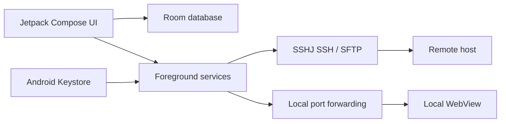

# QuickSSH

> An Android SSH workspace for persistent terminals, SFTP transfers, and local port forwarding.

[中文版 README](README.md)

[](app/src/main/AndroidManifest.xml)
[](gradle/libs.versions.toml)
[](LICENSE)

QuickSSH is a native Android SSH client built around real remote-development workflows: persistent shell sessions, SFTP file operations, and access to private services through SSH tunnels. It uses Jetpack Compose for the UI, SSHJ for SSH/SFTP, Room for local persistence, and Android Keystore for credential protection.

## Why this project

Mobile SSH tools often stop at “connect and type commands”. In practice, developers also need to switch between project workspaces, keep long-running sessions alive, move files with recoverable progress, and reach services that should remain private. QuickSSH brings these workflows into one explicit, testable local workspace.

## Design Highlights

### Workspace-aware server profiles

**Motivation:** One server can host multiple projects or environments. A single flat connection record forces users to repeatedly re-enter working directories, terminal preferences, and post-connect commands, increasing the chance of using the wrong environment.

**Implementation:** Server profiles are grouped by `host / port / username / authType`, while each workspace stores its own working directory, post-connect command, terminal settings, and shortcuts. Room stores servers, workspaces, tunnel presets, and transfer history with migrations for upgrades.

### Long-running SSH sessions

**Motivation:** Backgrounding or locking a phone should not terminate an important shell task. Binding the SSH connection directly to a screen makes that failure mode almost inevitable.

**Implementation:** Foreground services own SSH sessions and support reconnecting after network recovery. The terminal layer handles ANSI colors, cursor control, TUI applications, selection/copy, UTF-8, and GB18030 output. Password and OpenSSH private-key authentication share the same lifecycle.

### Observable and recoverable SFTP transfers

**Motivation:** On a phone, users need to know whether a transfer is queued, progressing, paused, or recoverable after a failure. A fire-and-forget upload is not a usable file workflow.

**Implementation:** The file browser supports multi-selection, pagination, recursive downloads, and confirmation plans. Transfers support conflict policies, queues, pause/resume, cancellation, retry, progress, and local history. A small SSHJ patch exposes transfer progress to the app's task model without replacing the transport layer.

### Terminal upload with automatic path insertion

**Motivation:** When running Codex or another file-aware TUI through SSH on a phone, uploading the file is only half the problem. Manually locating the remote path and switching back to the terminal interrupts the task and is especially awkward on a touch screen.

**Implementation:** The terminal input bar has a dedicated upload action. Selected files are uploaded through the active SSH session into the current workspace's `.QuickSSH/upload` directory. After the transfer completes, QuickSSH inserts shell-safe remote paths directly into the terminal input field, ready for a command or a TUI that accepts file paths. Progress, successful paths, and failures remain visible in transfer history.

### SSH tunnels for private services

**Motivation:** Development services are often bound to a remote loopback interface or private network. Port forwarding lets the phone reach those services without exposing them publicly.

**Implementation:** QuickSSH supports local forwarding, automatic local-port allocation, multiple tunnels, reconnects, and a WebView for the forwarded local endpoint. HTTP Basic Auth prompts are handled inside the tunnel workflow.

### Explicit credential and host-key boundaries

**Motivation:** SSH credentials and host identity are high-value security material. Encrypting only the database, or passing plaintext credentials through service intents, is not a sufficient boundary.

**Implementation:** Passwords and private keys are encrypted with an Android Keystore-backed AES-GCM key. Optional biometric unlock protects credential access. Strict host-key verification rejects unknown or changed fingerprints. Backups can be encrypted with a user-supplied password using PBKDF2 and AES-GCM.

## Architecture



```text
app/src/main/java/com/quickssh/app/
├── MainActivity.kt              # Navigation and workflow orchestration
├── data/                        # Room entities, DAOs, migrations, backups
├── security/                    # Android Keystore encryption
├── service/                     # SSH, SFTP, transfer, and tunnel services
├── ui/screens/                  # Compose screens and interaction flows
└── utils/                       # ANSI rendering and terminal buffering
net/schmizz/sshj/                # Small transfer-progress patch
scripts/                         # Local build and emulator helpers
```

## Verification

The repository includes tests for terminal rendering and input, SSH authentication and host-key decisions, Room migrations, encrypted backups, transfer queues, tunnel parameters, and key UI flows.

```powershell
.\gradlew.bat testDebugUnitTest
```

With a connected emulator or device:

```powershell
.\gradlew.bat connectedDebugAndroidTest
```

## Build

Requirements: Android Studio or Gradle-compatible CLI, JDK 17, Android SDK 34, and Gradle 8.5 through the checked-in wrapper.

```powershell
.\gradlew.bat assembleDebug
```

The APK is written to `app/build/outputs/apk/debug/app-debug.apk`.

## Technology

- Android `minSdk 26`, `targetSdk 34`
- Kotlin, Jetpack Compose, Material 3
- Room
- SSHJ and Bouncy Castle
- Android Keystore and AndroidX Biometric

## Privacy and scope

No real server addresses, accounts, passwords, private keys, or local machine paths are included in the repository. Runtime configuration stays on the device; credentials are protected with Android Keystore. Local debug configuration, build outputs, emulator artifacts, and logs are ignored by Git.

## License

MIT License. Copyright (c) 2026 Chengliang Liu. See [LICENSE](LICENSE) and [NOTICE](NOTICE).
