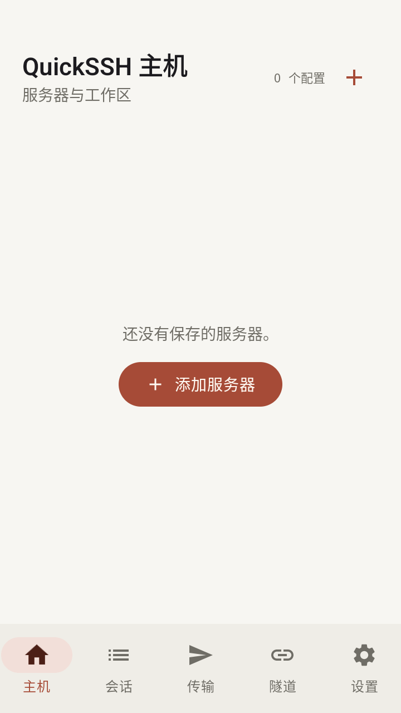
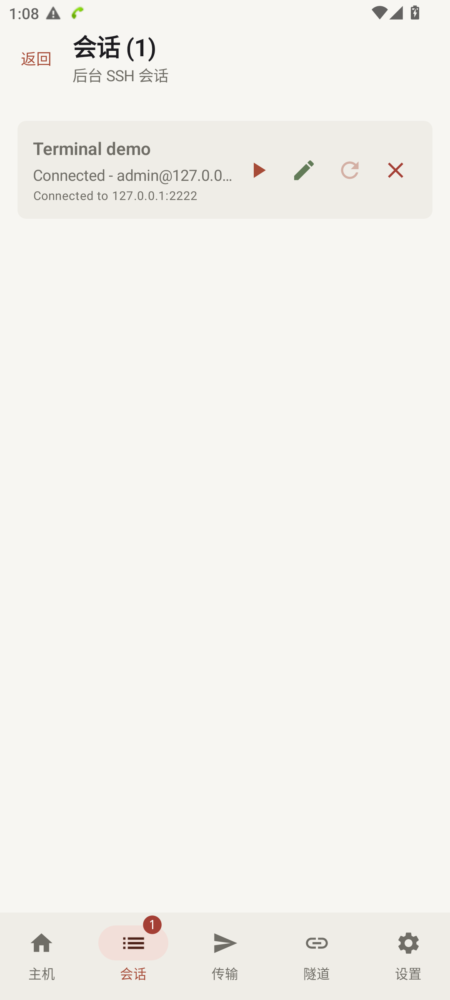
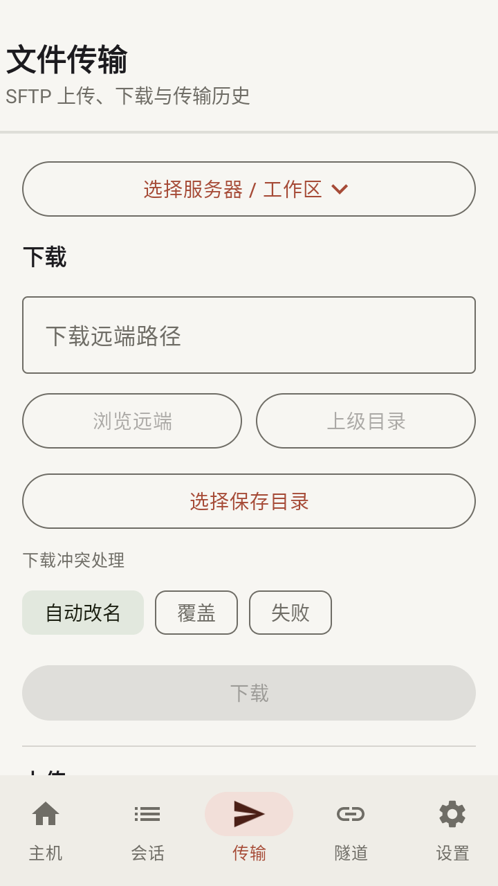
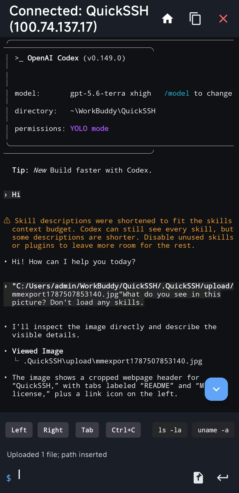
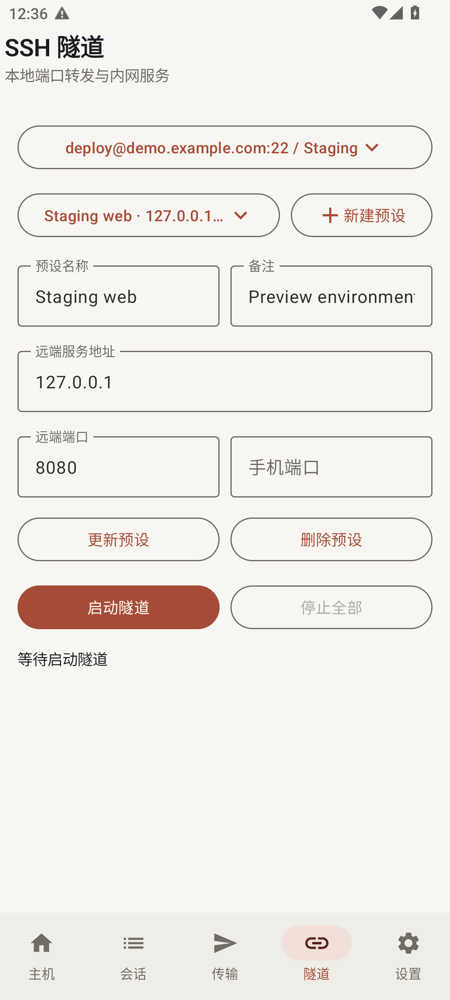
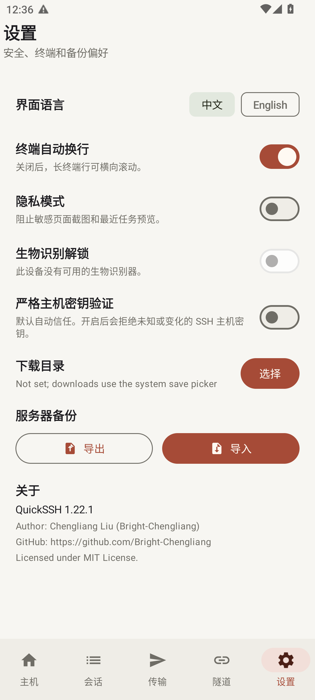
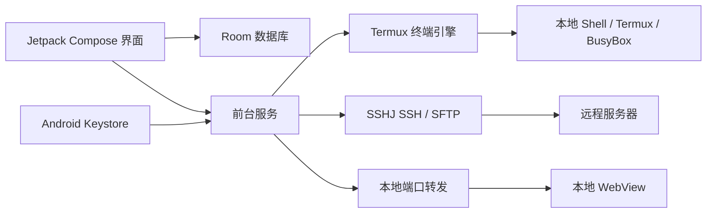

# QuickSSH

> 面向真实开发工作流的 Android 全栈终端工作台：本地 Shell、持久 SSH 终端、Termux 引擎、SFTP 文件传输与 SSH 隧道。

[](app/src/main/AndroidManifest.xml)
[](gradle/libs.versions.toml)
[](LICENSE)

[English README](README.en.md)

QuickSSH 是一款面向 Android 的终端工作台与 SSH 客户端，将本地 Shell、远程服务器配置、多工作区、Termux 终端引擎、文件传输和 SSH 隧道整合在一个应用中。它使用 Jetpack Compose 构建界面，通过 Termux 内核与 SSHJ 建立本地与远程会话，并用 Android Keystore 加密保存在设备本地的密码和私钥。

Developed by [Bright-Chengliang](https://github.com/Bright-Chengliang) · © 2026 Chengliang Liu · [MIT License](LICENSE)

## 项目定位

手机上的终端工具通常要么只做“本地终端（如 Termux）”，缺乏多工作区与现代工作流整合；要么只做“简单 SSH 客户端”，无法在无网环境下离线工作，切后台容易丢连接，且全屏 TUI 工具（如 OpenCode、Codex）在触屏下难以顺畅滑动。QuickSSH 的设计目标，是把“本地 Shell + 远程 SSH”收敛为统一的双模全栈工作台，把多环境隔离、后台保活、文件往返、内网穿透以及丝滑触屏交互放在明确的边界内。

## 核心亮点与设计动机

### 1. 服务器配置与多工作区

<ins><em>同一台服务器上的不同项目，可以各自保留目录、命令和终端设置，切换时不用重复配置。</em></ins>

**设计动机：** 同一台服务器往往对应多个项目或部署环境；如果只保存一条 SSH 连接，用户每次都要重新输入目录、终端偏好和连接后命令，容易连错环境。

**具体实现：** QuickSSH 按 `host / port / username / authType` 聚合服务器，并允许每个工作区独立保存工作目录、连接后命令、终端字号、自动换行、`TERM` 和快捷命令。服务器、工作区、隧道预设和传输历史都通过 Room 持久化，并通过数据库迁移保留升级后的历史数据。

<p align="center"></p>

### 2. 可长期运行的 SSH 终端

<ins><em>手机切到后台或锁屏后，远端命令仍可继续运行，回到应用即可接着操作。</em></ins>

**设计动机：** 移动端最容易丢失的是长连接。切到后台、锁屏或网络短暂变化后，终端会话如果直接绑定 UI，就会中断正在运行的任务。

**具体实现：** SSH 会话由前台服务托管，支持网络恢复后的自动重连；终端层处理 ANSI 颜色、光标控制、TUI 应用、滚轮回退、行列选择、复制，以及 UTF-8 和 GB18030 输出解码。密码认证与 OpenSSH 私钥认证走统一的连接生命周期。

<p align="center"></p>

### 3. 可观察、可恢复的 SFTP 传输

<ins><em>不用另开 SFTP 工具，在同一个 SSH 工作区里就能浏览远端文件目录，完成本地与远端之间的文件上传下载，并看到进度和队列。</em></ins>

**设计动机：** 手机上进行文件传输时，用户最关心的不是“请求是否发出”，而是任务是否排队、进度到哪里、失败后能否恢复，以及目录递归操作是否可控。

**具体实现：** 文件浏览器支持多选、分页、目录递归下载和下载计划确认；上传支持自动改名、覆盖和失败三种冲突策略。传输任务由前台服务执行，提供队列、暂停/恢复、取消等待、断线重试和实时进度，并记录最近 300 条传输历史。项目对 SSHJ 的传输层做了小范围补丁，使进度回调能够进入应用自己的任务队列。

<p align="center"></p>

### 4. 终端内快速上传与路径回填

<ins><em>在手机 SSH 终端里选中文件，上传到远端后，路径会自动填回输入框，直接交给 Codex 读取和分析。</em></ins>

**设计动机：** 在手机 SSH 中启动 Codex 等具有文件读取能力的 agent 时，真正麻烦的不是把文件传到服务器，而是上传后还要手动查找远端路径，再切回终端输入。只要把文件路径交给 agent，它就可以根据路径读取和分析文件；这个上传、查找、回填的过程在触屏设备上尤其繁琐。
**具体实现：** 终端输入栏提供独立的文件上传入口。选中的文件会通过当前 SSH 会话上传到当前工作区的 `.QuickSSH/upload` 目录；上传完成后，应用会将远端文件路径自动以 shell 安全格式回填到终端输入框，用户可以直接把路径交给 agent 读取和分析。上传进度、成功路径和失败状态会同步到传输历史。

<p align="center"></p>

### 5. SSH 隧道与移动端内网访问

<ins><em>远端只在内网开放的网页或服务，也能通过 SSH 隧道直接在手机上访问。</em></ins>

**设计动机：** SSH 的价值不只在终端；很多开发服务只绑定在远端回环地址或内网中，手机需要通过端口转发访问，而不是把服务暴露到公网。

**具体实现：** 支持本地端口转发、自动分配本地端口、多隧道并行和断线重连；隧道由独立前台服务托管，并提供 WebView 访问转发后的本地地址和 HTTP Basic Auth 交互。

<p align="center"></p>

### 6. 凭据保护与主机密钥验证

<ins><em>密码和私钥留在设备安全存储中，连接前还能核对服务器身份。</em></ins>

**设计动机：** SSH 客户端保存的是高价值凭据；仅仅把密码放进本地数据库，或在服务 Intent 中传递明文，都无法形成可信的安全边界。

**具体实现：** 密码和私钥使用 Android Keystore 中的 AES-GCM 密钥加密后入库，不通过前台服务 Intent 明文传递；可选生物识别解锁，连接或编辑凭据前要求验证。主机密钥验证默认记录首次观察到的指纹，开启严格模式后拒绝未知或变化的指纹，并将待确认指纹交给用户处理。服务器配置支持导出/导入，导出时可以用用户提供的密码进行 PBKDF2 + AES-GCM 加密。

<p align="center"></p>

### 7. 本地终端模式与 Termux 原生引擎

<ins><em>无需联网直接调用手机系统 Shell、Termux 或内置 Linux 环境，全屏 TUI 应用触屏手势丝滑滚动。</em></ins>

**设计动机：** 开发者不仅需要远程运维，也经常需要在本地跑脚本、执行 Git 命令或与本地运行的 AI CLI（如 OpenCode、Codex）交互。传统方案要么在 Termux 与 SSH 工具间频繁切后台，要么在全屏 TUI 中遇到触摸滑动无法上下滚动历史消息的痛点。

**具体实现：** 应用全面集成 Termux 原生终端内核（`TerminalView` & `TerminalEmulator`），提供标准 PTY、全量 DEC 控制序列与真彩 ANSI 渲染。新增“本地终端模式”，自动探测并直连系统 Shell (`/system/bin/sh`)、Termux 环境 (`/data/data/com.termux/files/usr/bin/bash`) 或应用内置的 Linux BusyBox 容器，完全复用多工作区配置与前台守护。针对 Windows ConPTY / SSH 下 TUI 工具缺失鼠标报告的场景，实现智能手势步长换算与 VT PageUp/PageDown 分发，使 OpenCode 等全屏 TUI 消息历史上下滑动获得与 Termux 原生完全一致的顺畅体验。

## 架构概览



项目按职责拆分为：`data/` 负责持久化、DAO 和迁移，`security/` 负责 Keystore 加密，`service/` 负责本地 PTY、SSH/SFTP/隧道生命周期及 Termux 桥接，`ui/screens/` 负责 Compose 与 Termux TerminalView 渲染工作流；`net/schmizz/sshj/` 只保留针对传输进度的局部补丁，没有另起一套传输实现。

## 测试与验证

仓库包含终端渲染与输入、SSH 认证和主机密钥决策、Room 迁移、加密备份、传输队列、隧道参数以及关键 UI 流程测试。

```powershell
.\gradlew.bat testDebugUnitTest
```

连接 Android 模拟器或真机后，可运行 instrumentation tests：

```powershell
.\gradlew.bat connectedDebugAndroidTest
```

## 技术栈

- Android：`minSdk 26`，`targetSdk 34`
- UI：Jetpack Compose + Material 3
- 终端引擎：Termux Terminal View & Emulator (v0.118.0) + 内嵌多架构 Linux BusyBox PTY
- 数据库：Room
- SSH/SFTP：SSHJ + Bouncy Castle
- 安全：Android Keystore、AndroidX Biometric

## 项目结构

```text
app/src/main/java/com/quickssh/app/
├── MainActivity.kt              # 导航、连接编排、传输队列
├── data/                        # Room 实体、DAO、数据库迁移、备份编解码
├── security/                    # Android Keystore 加密
├── service/                     # 本地 PTY、SSH/SFTP、Termux 会话桥接与前台守护
├── ui/screens/                  # 主机列表、终端 (Compose + TermuxView)、传输、设置
└── utils/                       # ANSI 渲染、终端缓冲
app/src/main/jniLibs/            # 内置多架构 BusyBox (arm64, arm, x86, x86_64)
net/schmizz/sshj/                # 针对 SFTP 进度与传输行为的本地补丁
scripts/                         # 本地构建与调试辅助脚本
```

## 构建

环境要求：

- Android Studio（或支持 Gradle 的命令行环境）
- JDK 17
- Android SDK 34
- Gradle 8.5（使用仓库内的 wrapper）

Windows：

```powershell
.\gradlew.bat assembleDebug
```

macOS / Linux：

```bash
./gradlew assembleDebug
```

APK 输出到 `app/build/outputs/apk/debug/app-debug.apk`。

安装到已连接的设备或模拟器：

```powershell
adb install -r app\build\outputs\apk\debug\app-debug.apk
```

运行单元测试：

```powershell
.\gradlew.bat testDebugUnitTest
```

## 数据与隐私说明

- 仓库不包含任何真实服务器地址、账号、密码、私钥、本机路径或调试截图。
- `local.properties`、`.workbuddy/`、`.QuickSSH/`、`outputs/`、`artifacts/`、构建产物和日志文件均已加入 `.gitignore`，不会进入版本库。
- App 的服务器配置、传输历史和隧道预设仍保存在设备本地的 Room 数据库中，凭据使用 Android Keystore 加密；本次清理不修改数据库版本、表结构或本地数据文件。
- 本地调试脚本 `scripts/Get-QuickSshDebugServer.ps1` 从被忽略的 `.workbuddy/quickssh-debug-server.local.ps1` 读取主机和工作目录，从 `.workbuddy/secrets/` 读取凭据，未配置时会明确报错，不会把隐私值写回源码。

## 开发脚本

`scripts/install-mumu-debug.ps1` 用于在 MuMu 模拟器上安装并启动 Debug APK。它只依赖 ADB，不包含任何服务器或账号信息。

## License

本项目使用 [MIT License](LICENSE)，版权归 Chengliang Liu 所有。

## Author

- GitHub: [Bright-Chengliang](https://github.com/Bright-Chengliang)
- Copyright: © 2026 Chengliang Liu
- Project notice: [NOTICE](NOTICE)
