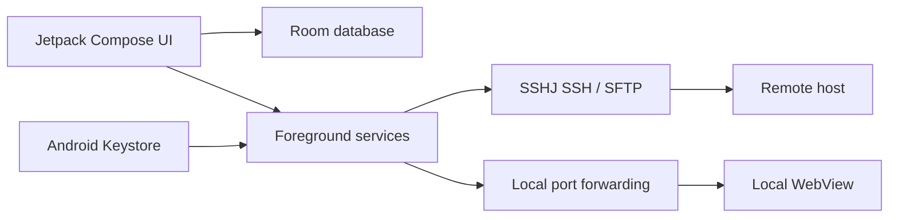

# QuickSSH

> A focused Android SSH workspace for persistent terminals, SFTP transfers, and local port forwarding.

[](app/src/main/AndroidManifest.xml)
[](gradle/libs.versions.toml)
[](LICENSE)

QuickSSH 是一款面向 Android 的 SSH 客户端，将服务器配置、多工作区、终端、文件传输和 SSH 隧道整合在一个应用中。它使用 Jetpack Compose 构建界面，通过 SSHJ 建立 SSH/SFTP 连接，并用 Android Keystore 加密保存在设备本地的密码和私钥。

Developed by [Bright-Chengliang](https://github.com/Bright-Chengliang) · © 2026 Chengliang Liu · [MIT License](LICENSE)

## Why this project

QuickSSH is designed around the workflows that are awkward to keep together on a phone: reconnecting to long-running shell sessions, moving files with visible progress, and reaching a private web service through an SSH tunnel. The app keeps credentials on-device, isolates long-running work in foreground services, and exposes strict host-key verification as an explicit security setting.

## Architecture



The app is split into `data/` for persistence and migrations, `security/` for Keystore-backed encryption, `service/` for SSH/SFTP/tunnel lifecycles, and `ui/screens/` for the Compose workflows. The small `net/schmizz/sshj/` patch keeps transfer progress observable without introducing a second transport implementation.

## Verification

The repository includes unit tests for terminal rendering and input, SSH authentication and host-key decisions, Room migrations, encrypted backups, transfer queues, tunnel parameters, and key UI flows.

```powershell
.\gradlew.bat testDebugUnitTest
```

Instrumentation tests cover Android-only flows and can be run with a connected emulator or device:

```powershell
.\gradlew.bat connectedDebugAndroidTest
```

## 功能特性

### 服务器与工作区

- 服务器按 `host / port / username / authType` 自动聚合，同一台服务器可以维护多个工作区。
- 每个工作区可独立配置默认工作目录、连接后命令、终端字号、自动换行、`TERM` 和快捷命令。
- 支持搜索服务器、工作区、路径，支持拖拽排序、复制、编辑、删除和一键测试连接。
- 服务器节点、工作区、隧道预设和传输历史保存在 Room 数据库中，升级时通过版本迁移保留历史数据。

### SSH 终端

- 支持密码认证和 OpenSSH 私钥认证。
- 支持 ANSI 颜色、TUI 应用、光标控制、滚轮回退、行列选择和复制。
- 支持 UTF-8 与 GB18030 输出解码，兼容常见中文终端内容。
- 支持粘贴确认、常用控制键、快捷命令和终端偏好设置。
- SSH 会话由前台服务托管，应用退到后台后仍可保持连接，并支持网络恢复后的自动重连。

### 文件传输

- 基于 SFTP 的本地文件上传和远端文件下载。
- 远端文件浏览器支持多选、分页、目录递归下载和下载计划确认。
- 上传支持自动改名、覆盖、失败三种冲突策略。
- 传输任务支持队列、暂停/恢复、取消等待、断线重试和实时进度。
- 传输由前台服务执行，退出应用后仍可继续；最近 300 条记录保存在本地。

### SSH 隧道

- 支持本地端口转发，把远端服务映射到手机端口。
- 可保存隧道预设，支持自动分配本地端口、多隧道并行、断线重连。
- 内置 WebView 打开隧道地址，并支持 HTTP Basic Auth 登录。

### 安全与隐私

- 密码和私钥使用 Android Keystore 中的 AES-GCM 密钥加密后入库，不通过前台服务 Intent 明文传递。
- 可选生物识别解锁，连接或编辑凭据前需要验证。
- 支持严格主机密钥验证，开启后拒绝未知或变化的 SSH 主机指纹。
- 隐私模式可阻止敏感界面被截图或进入最近任务预览。
- 支持服务器配置导出/导入，导出时可选择用密码加密备份文件。

## 技术栈

- Android：`minSdk 26`，`targetSdk 34`
- UI：Jetpack Compose + Material 3
- 数据库：Room
- SSH/SFTP：SSHJ + Bouncy Castle
- 安全：Android Keystore、AndroidX Biometric

## 项目结构

```text
app/src/main/java/com/quickssh/app/
├── MainActivity.kt              # 导航、连接编排、传输队列
├── data/                        # Room 实体、DAO、数据库迁移、备份编解码
├── security/                    # Android Keystore 加密
├── service/                     # SSH、SFTP、传输和隧道前台服务
├── ui/screens/                  # 列表、添加/编辑、终端、传输、隧道、设置
└── utils/                       # ANSI 渲染、终端缓冲
net/schmizz/sshj/                # 针对 SFTP 进度与传输行为的本地补丁
scripts/                         # 本地构建与调试辅助脚本
```

## 构建

环境要求：

- Android Studio（或支持 Gradle 的命令行环境）
- JDK 17
- Android SDK 34
- Gradle 8.5（使用仓库内的 wrapper）

Windows：

```powershell
.\gradlew.bat assembleDebug
```

macOS / Linux：

```bash
./gradlew assembleDebug
```

APK 输出到 `app/build/outputs/apk/debug/app-debug.apk`。

安装到已连接的设备或模拟器：

```powershell
adb install -r app\build\outputs\apk\debug\app-debug.apk
```

运行单元测试：

```powershell
.\gradlew.bat testDebugUnitTest
```

## 数据与隐私说明

- 仓库不包含任何真实服务器地址、账号、密码、私钥、本机路径或调试截图。
- `local.properties`、`.workbuddy/`、`.QuickSSH/`、`outputs/`、`artifacts/`、构建产物和日志文件均已加入 `.gitignore`，不会进入版本库。
- App 的服务器配置、传输历史和隧道预设仍保存在设备本地的 Room 数据库中，凭据使用 Android Keystore 加密；本次清理不修改数据库版本、表结构或本地数据文件。
- 本地调试脚本 `scripts/Get-QuickSshDebugServer.ps1` 从被忽略的 `.workbuddy/quickssh-debug-server.local.ps1` 读取主机和工作目录，从 `.workbuddy/secrets/` 读取凭据，未配置时会明确报错，不会把隐私值写回源码。

## 开发脚本

`scripts/install-mumu-debug.ps1` 用于在 MuMu 模拟器上安装并启动 Debug APK。它只依赖 ADB，不包含任何服务器或账号信息。

## License

本项目使用 [MIT License](LICENSE)，版权归 Chengliang Liu 所有。

## Author

- GitHub: [Bright-Chengliang](https://github.com/Bright-Chengliang)
- Copyright: © 2026 Chengliang Liu
- Project notice: [NOTICE](NOTICE)
